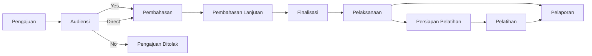

# Besaran Aplikasi Kerja Sama — Ditjen GTKPG

> Dikonversi dari `Flow Aplikasi Kerja Sama (1) (1).pdf` via markitdown. Struktur dirapikan dari hasil ekstraksi slide.

## 4 Fase Besar

| # | Fase | Keterangan |
|---|------|------------|
| 01 | **Pengajuan** | Dapat dilakukan oleh Mitra, UPT, Direktorat Teknis, dan Setditjen GTK |
| 02 | **Pembahasan** | Melibatkan mitra, direktorat teknis terkait, Biro Perencanaan dan Kerja Sama, serta Biro Hukum |
| 03 | **Pelaksanaan** | Dilakukan mitra dan tim teknis yang menjadi sasaran dari kerja sama (UPT/Direktorat) |
| 04 | **Pelaporan** | Mencakup laporan per kegiatan/pelatihan dan laporan akhir keseluruhan pelaksanaan kerja sama |

## Flowchart Partnership

## 01 — Pengajuan

| Step | Tahap | Keterangan |
|------|-------|------------|
| 1 | Pendaftaran Akun | Mitra melakukan pendaftaran akun |
| 2 | Unggah Dokumen | Mitra mengunggah surat pengajuan kerja sama, proposal kerja sama, dokumen legalitas, dan profil perusahaan |
| 3 | Verifikasi | UPT/Direktorat/Setditjen melakukan validasi awal terkait pengajuan kerja sama yang disampaikan |
| 4 | Audiensi | Melaksanakan audiensi dengan melibatkan mitra, direktorat teknis sesuai sasaran/UPT, dan tim kerja sama Setditjen GTK |

## 02 — Pembahasan

| # | Tahap | Keterangan |
|---|-------|------------|
| 1 | Pembahasan Awal | Pemetaan ruang lingkup serta hak dan kewajiban, melibatkan Biro Roren KS dan Biro Hukum |
| 2 | Pembahasan Lanjutan | Pembahasan keseluruhan naskah kerja sama |
| 3 | Pembahasan RK | Melakukan pembahasan detail rencana kerja |
| 4 | Finalisasi | Pembahasan final draf naskah kerja sama dan rencana kerja |
| 5 | Validasi | Proses paraf pimpinan dan surat kuasa (jika diperlukan); pengajuan nomor PKS ke Biro Hukum |
| 6 | Penandatanganan | Dokumen ditandatangani dan diarsipkan |

## 03 — Pelaksanaan (Pelatihan)

| # | Tahap | Keterangan |
|---|-------|------------|
| 1 | Digitalisasi Rencana Kerja | RK yang sudah disepakati didigitalisasi untuk mengukur keterlaksanaan dan timeline pelaksanaan setiap ruang lingkup, terutama jika berkaitan dengan pelatihan |
| 2 | Persiapan | Koordinasi dengan tim terkait dalam pelaksanaan pelatihan |
| 3 | Pendaftaran | Peserta pelatihan mendaftar menggunakan NUPTK agar terdata dan terintegrasi dengan Dapodik |
| 4 | Pelaksanaan | Pelaksanaan pelatihan oleh mitra dengan tetap dikawal oleh GTK |
| 5 | Monev | Menggunakan instrumen monev yang didigitalisasi untuk menilai performa setiap mitra |
| 6 | Pelaporan | Mitra mengunggah laporan setiap pelaksanaan pelatihan dan laporan akhir pelaksanaan kerja sama di aplikasi |

## 04 — Pelaporan

- **Instrumen Monev** — instrumen monitoring dan evaluasi didigitalisasi dalam aplikasi
- **Laporan Kegiatan/Pelatihan** — laporan pelaksanaan kegiatan/pelatihan diunggah di aplikasi setiap selesai pelaksanaan kegiatan
- **Pelaksanaan Monitoring Evaluasi** — monev minimal 1 kali dalam satu tahun kerja sama
- **Laporan Akhir** — diunggah mitra pada aplikasi di akhir masa kerja sama

## Diskusi

- UPT dapat melakukan rekap kerja sama yang tidak berbentuk PKS/NK/MOU, terutama yang berbentuk pelatihan
- Tidak semua kerja sama harus menggunakan PKS; jika hanya satu kali pelaksanaan, bisa dalam bentuk komitmen bersama atau berita acara saja
